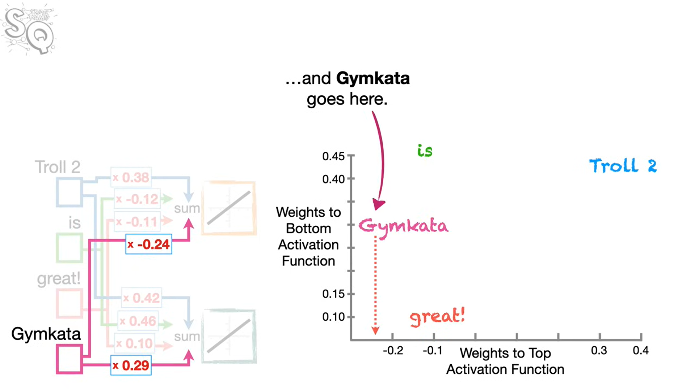
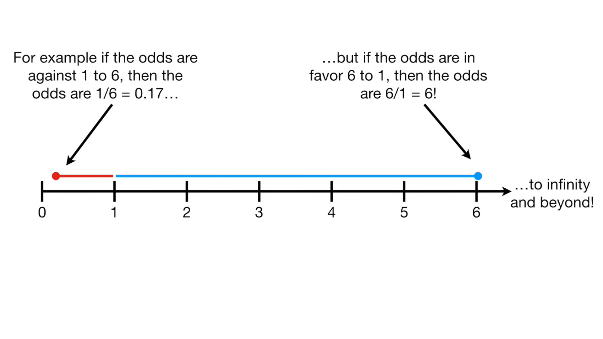
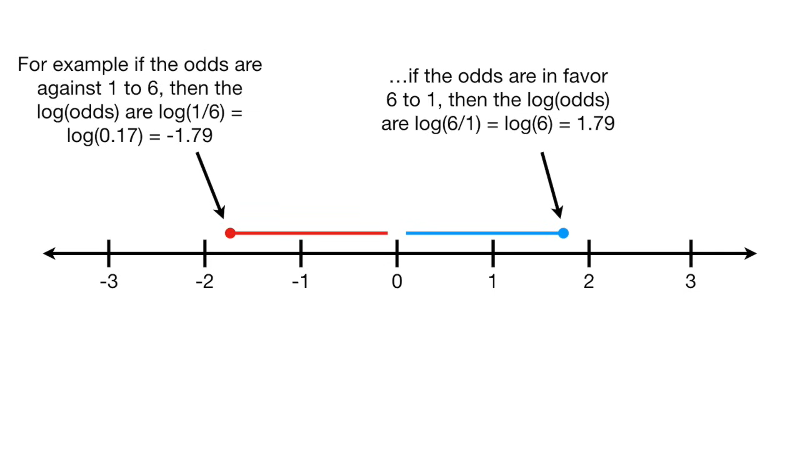

Huge thanks to [Statquest with Josh Starmer](https://www.youtube.com/@statquest)  
Elements of statistical learning: Holy grail of ML

# NLP

## 📘 TF-IDF (Term Frequency–Inverse Document Frequency)

### 🧠 Concept

TF-IDF scores a word’s importance in a document relative to a corpus. Common in NLP for converting text into numerical features.

### 🔢 Formula

$$
\text{TF-IDF}(t, d) = \text{TF}(t, d) \times \text{IDF}(t)
$$

Where:

- $ \text{TF}(t, d) = \frac{f\_{t,d}}{N_d} $

  - frequency of term $t$ in document $d$
  - $f_{t,d}$: count of $t$ in $d$
  - $N_d$: total terms in $d$

- $ \text{IDF}(t) = \log \left( \frac{1 + |D|}{1 + \text{df}(t)} \right) + 1 $
  - $|D|$: number of documents
  - $\text{df}(t)$: number of docs containing $t$

## 📘 Word2Vec

### 🧠 Concept

Word2Vec is a neural network-based method to learn dense vector representations (embeddings) of words such that semantically similar words are close in the vector space. It captures both syntactic and semantic relationships.

The weights of the layer is the ones used as the vector representations, for example Gymkata will have a vector of [-0.24, 0.29]

### 🧩 Architectures

Word2Vec has two main architectures:

1. **CBOW (Continuous Bag of Words)**  
   Predicts the target word from its surrounding context.  
   eg: using "Troll 2" and "great!" predict "is:

2. **Skip-Gram**  
   Predicts surrounding context words from a target word.
   eg: using "is" predict "Troll 2" and "great!" and "Gymkata"

## Lemmatization vs Stemming

#### Lemmatization

Reduces a word to its base or dictionary form (lemma), using vocabulary and grammar rules  

Examples:

- am, are, is → be

- running → run

- better → good

#### Stemming

Process that chops off word suffixes to reduce words to their root form  

Examples:

- running → run

- makes → make

- nothing → noth

# General Concepts

## 🧠 Semi-Supervised Learning

### 📌 Definition

**Semi-supervised learning (SSL)** is a learning paradigm where the model is trained using **a small amount of labeled data** and **a large amount of unlabeled data**.

It lies between:

- **Supervised learning** (all data labeled)
- **Unsupervised learning** (no labeled data)

### 🚀 Why Use It?

- Labeling data is expensive/time-consuming.
- Easy to collect massive **unlabeled** data (e.g., web images, text).
- Boosts performance when only limited labeled data is available.

### 🔁 Example Workflow

1. Start with small labeled dataset $L$ and large unlabeled dataset $U$
2. Train initial model on $L$
3. Predict labels for samples in $U$ (pseudo-labeling)
4. Add confident predictions from $U$ to $L$
5. Retrain and repeat

### 📊 Comparison Table

| Feature             | Supervised   | Semi-Supervised | Unsupervised |
| ------------------- | ------------ | --------------- | ------------ |
| Label requirement   | High         | Low             | None         |
| Data efficiency     | Moderate     | High            | Variable     |
| Complexity          | Low–Moderate | Moderate–High   | Moderate     |
| Use labeled data?   | ✅           | ✅ (few)        | ❌           |
| Use unlabeled data? | ❌           | ✅              | ✅           |

## 📘 L1 vs L2 Regularization

### 🧠 Concept

Both L1 and L2 regularization are techniques used to prevent overfitting in regression by adding a penalty to the loss function.

- **L1 (Lasso)** encourages sparsity → performs feature selection.
- **L2 (Ridge)** encourages small but non-zero weights → stabilizes the model.

### 🔢 Objective Functions

Let:

- $X$: feature matrix
- $y$: target vector
- $\hat{y} = Xw$: model prediction
- $w$: weight vector
- $\lambda$: regularization strength

#### L1 Regression (Lasso):

$$
\min_w \; \text{cost} + \lambda \| w \|_j
$$

- $\| w \|_1 = \sum_i |w_i|$: L1 norm

#### L2 Regression (Ridge):

$$
\min_w \; \text{cost} + \lambda w_{j}^{2}
$$

### ✅ Notes

- L1 is useful when only a few features are expected to be important.
- L2 is better when all features contribute a little.
- **Elastic Net** combines both: $L1 + L2$.

## 📘 Cross Entropy

### 🧠 Concept

Cross entropy is a loss function used to quantify the difference between two probability distributions — typically the true labels and predicted probabilities. It measures how well a model's predicted distribution aligns with the actual distribution.

Common in classification tasks, especially with softmax outputs.

### 🔢 Formula

For a single prediction with true label vector $y = [y_1, y_2, ..., y_K]$ and predicted probabilities $\hat{y} = [\hat{y}_1, \hat{y}_2, ..., \hat{y}_K]$ over $K$ classes:

$$
\text{CrossEntropy}(y, \hat{y}) = -\sum_{i=1}^{K} y_i \log(\hat{y}_i)
$$

- $y_i$: true probability for class $i$ (usually 0 or 1 in one-hot encoding)
- $\hat{y}_i$: predicted probability for class $i$

### ✅ Binary Case (Two Classes)

When $y \in \{0, 1\}$ and $\hat{y} \in (0, 1)$:

$$
\text{CE}(y, \hat{y}) = -[y \log(\hat{y}) + (1 - y) \log(1 - \hat{y})]
$$

### 📌 Properties

- Lower cross entropy → better model predictions.
- Perfect prediction (e.g., $\hat{y}_i = 1$ for correct class) → cross entropy = 0.
- Penalizes wrong predictions more than just SSR (sum of squared residuals).

## 📘 Decision Trees

### 🧠 Concept

A Decision Tree is a non-parametric supervised learning algorithm used for classification and regression. It recursively splits the data into subsets based on feature values to create a tree-like structure of decisions.

### 🌲 Structure

- **Root Node**: Represents the entire dataset.
- **Internal Nodes**: Feature-based decisions.
- **Leaf Nodes**: Output prediction (class label or value).
- **Branches**: Outcomes of decisions.

### 🔍 Splitting Criteria

To choose the best split at each node, Decision Trees use **impurity measures**. Common ones:
Gini Impurity, Entropy and information gain

#### 1. **Gini Impurity** (Classification)

$$
\text{Gini}(D) = 1 - \sum_{i=1}^{C} p_i^2
$$

- $C$: number of classes
- $p_i$: proportion of class $i$ in dataset $D$

#### 2. **Entropy** (Classification, used in ID3)

$$
\text{Entropy}(D) = - \sum_{i=1}^{C} p_i \log_2(p_i)
$$

### 🔢 Numerical Features

1. Sort the samples according to said feature
2. Get mean of each consecutive value
3. Split using these values and choose the best one according to splitting criteria
4. Compare best one with other features

### ✂️ Stopping Criteria

- Maximum depth
- Minimum samples per leaf
- Minimum impurity decrease
- No further gain in split quality

## 🌳 Random Forest, AdaBoost & Gradient Boosting

### 🌲 1. Random Forest

**Concept**:  
An ensemble of decision trees trained independently using _bagging_ (bootstrap aggregation). Predictions are averaged (regression) or voted (classification).

**Key Ideas**:

- Reduces **variance**
- Trains trees on random subsets of data and features
- Improves generalization and avoids overfitting

**Training Steps**:

1. Sample dataset with replacement (bootstrap)
2. At each split, choose a random subset of features
3. Train multiple decision trees independently
4. Aggregate predictions

### ⚡ 2. AdaBoost (Adaptive Boosting)

**Concept**:  
Boosting technique that trains **weak learners** sequentially. Each learner focuses more on the samples that were misclassified by the previous ones.

**Key Ideas**:

- Weak learner are almost always stumps (root and 2 leaves)
- Stump prediction is weighted
- Each stump is made by taking the previous stumps mistakes into account

1. Each sample is equally weighted (sum of 1) (equally important)
2. Using the normal decision tree method create a root and 2 leaves (but weighted by sample weights or just create a new dataset by sampling from current with sample weights as probability distribution)
3. The error is the total weight of the samples incorrectly classified
4. Stump amount of say = $\frac{1}{2} \log{\frac{1-\text{Total Error}}{Total Error}}$
5. Update Sample weights

#### Sample Weights

Decrease weight of correctly predicted samples and increase weight of incorrectly predicted samples

$$
\text{New Sample Weight (incorrectly predicted)} = \text{sample weight} \times \exp^{\text{amount of say}}
$$

$$
\text{New Sample Weight (correctly predicted)} = \text{sample weight} \times \exp^{-\text{amount of say}}
$$

### 📉 3. Gradient Boosting

**Concept**:  
Boosting method where each new model learns to correct the **residual errors** of the previous ensemble using gradient descent in function space.

**Key Ideas**:

- Ensemble of trees restricted by some value (most commonly max number of leaves is 8-32)
- Models are added sequentially to minimize a loss
- Uses gradients of the loss function for optimization

1. First prediction is mean or log(odds)
2. Calculate the (pseudo) residuals (prediction - real)
3. Build tree to predict residuals (if leaf contains more than 1, take average) (weighted by learning rate)

Classification is a bit different but the same concept

**Training Objective** (at each step):

$$
F_m(x) = F_{m-1}(x) + \eta h_m(x)
$$

- $F_m(x)$: ensemble model at step $m$
- $h_m(x)$: new weak learner trained on residuals
- $\eta$: learning rate (shrinkage)

## ⚖️ Comparison Table

| Feature                  | Random Forest            | AdaBoost                   | Gradient Boosting         |
| ------------------------ | ------------------------ | -------------------------- | ------------------------- |
| Strategy                 | Bagging (parallel trees) | Boosting (sequential)      | Boosting (sequential)     |
| Focus                    | Reduces variance         | Reduces bias               | Reduces bias              |
| Learner Type             | Full decision trees      | Shallow trees (stumps)     | Shallow trees             |
| Weighting of Predictions | Equal weights            | Weighted samples           | Equal Weights             |
| Training Style           | Parallel                 | Sequential                 | Sequential                |
| Speed                    | Fast (parallelizable)    | Moderate                   | Slower                    |
| Overfitting Tendency     | Low                      | Moderate                   | High (use regularization) |
| Handles Noise Well       | Yes                      | No (sensitive to outliers) | No (can overfit to noise) |

## 🎯 Odds vs. Probability

### 🔢 1. **Probability (P)**

**Definition**:  
The likelihood that a specific event **will** occur, out of all possible outcomes.

**Formula**:

$$
P(A) = \frac{\text{Number of favorable outcomes}}{\text{Total number of outcomes}}
$$

**Range**:

$$
0 \leq P(A) \leq 1
$$

- $P(A) = 0$: impossible event
- $P(A) = 1$: certain event

---

### 🎲 2. **Odds**

**Definition**:  
The ratio of the probability that the event **will** occur to the probability that it **won’t**.

**Formula (Odds in favor)**:

$$
\text{Odds}(A) = \frac{P(A)}{1 - P(A)}
$$

**Odds > 1**: Event more likely to occur  
**Odds < 1**: Event less likely to occur

Asymmetric even if the exact opposite so we use log

using log

#### Logit function

$$
\log{\frac{p}{1-p}}
$$

### 🔁 Convert Between Odds and Probability

- From **odds to probability**:

$$
P(A) = \frac{\text{Odds}(A)}{1 + \text{Odds}(A)}
$$

- From **probability to odds**:

$$
\text{Odds}(A) = \frac{P(A)}{1 - P(A)}
$$

---

### 📊 Example

If the probability of rain is 0.8:

- **Odds of rain**:

$$
\text{Odds} = \frac{0.8}{1 - 0.8} = \frac{0.8}{0.2} = 4
$$

> "4 to 1" odds of rain = 4 chances for rain vs 1 against.

---

### 🧾 Use Cases

| Concept     | Used in                           |
| ----------- | --------------------------------- |
| Probability | General statistics, ML evaluation |
| Odds        | Logistic regression, betting      |

In **logistic regression**, the model predicts:

$$
\log \left( \frac{P(y=1)}{1 - P(y=1)} \right) = \text{linear function}
$$

This is called the **log-odds** or **logit**.

## ✂️ Pruning in Decision Trees

### 🌳 What is Pruning?

Pruning is the process of **removing a subtree**—specifically, a **node and its two child leaves**—and replacing it with a **single leaf**. This simplifies the tree to reduce overfitting and improve generalization.

### ⏹️ When Do We Stop Pruning?

To decide whether to prune or keep a subtree, we evaluate whether pruning improves model performance (usually on a validation set). One common and principled method to guide this is:

### 🧮 Cost-Complexity Pruning

**Goal**: Balance tree accuracy and complexity.

**Cost-complexity function**:

$$
R_\alpha(T) = R(T) + \alpha \cdot |T|
$$

- $R(T)$: total misclassification error (or loss) of tree $T$
- $|T|$: number of leaves in the tree
- $\alpha$: complexity parameter that penalizes larger trees

We select the subtree $T$ that **minimizes** $R_\alpha(T)$. Higher $\alpha$ favors **simpler trees**, preventing overfitting.

## 📌 K-Nearest Neighbors (KNN)

### 🔧 How KNN Works (Step-by-Step)

1. **Choose K** = number of neighbors to consider (e.g., 3, 5, 7)
2. For a new data point:
   - Compute the **distance** to all points in the training set (commonly Euclidean)
3. Identify the **K closest** points
4. **Classification**: majority vote
5. **Regression**: average of neighbors’ values

## 📌 K-Means Clustering

**K-Means** is an **unsupervised learning** algorithm that partitions data into **K clusters** where each point belongs to the cluster with the **nearest mean (centroid)**.

---

### 🔧 How K-Means Works (Step-by-Step)

1. **Initialize**: Randomly pick `K` centroids.
2. **Assignment Step**: Assign each point to the nearest centroid (based on Euclidean distance).
3. **Update Step**: Recalculate each centroid as the mean of its assigned points.
4. **Repeat** steps 2–3 until convergence:
   - Centroids stabilize, or
   - Assignments stop changing, or
   - Max iterations reached

# Small Notes

#### Multilabel Classification vs Multiclass Classification

- **Multilabel Classification**: More than 2 mutually exclusive classes (one hot vectors)
- **Multiclass Classification**: Multiple labels that can be true at once (Movie Genres)

#### N grams

- We just extract number n of words, for example if bigram (2-gram) so use pairs of consecutive words. "KDB" "the" "PL" "goat" is converted to "KDB the" "the PL" "PL goat".
- **Purpose:** To get a better understanding of the context by capturing the local word dependencies

#### Bootstrapped Dataset

- Same exact length of the original dataset but we sample from it with replacement (so same sample can be chosen more than once)

#### Non-parametric Approach

No parameters (can have hyperparams) needed, so no model is actually saved like KNN (no params only hyperparams (k neighbors))

#### Naive Bayes

It is named as "Naive" because it assumes the presence of one feature does not affect other features.

#### Deductive and Inductive Learning

- **Deductive** learning is learning or reasoning from general rules to specific conclusions.
- **Inductive** learning is learning from specific examples to infer general rules.
